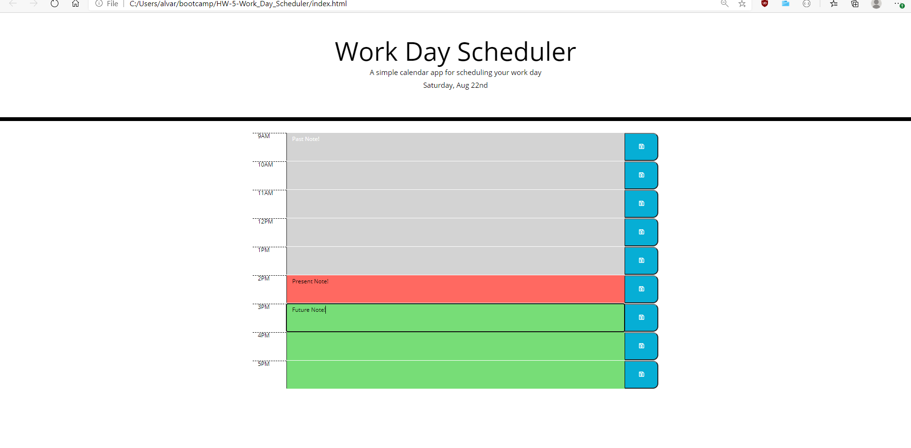

# HW-5-Work_Day_Scheduler

The following HTML is a scheduler that lets you save note/descriptions for every hour of a typical 9AM-5AM work day. Gray time blocks are in the past hours, red in the present, green in the furute.

[Link](https://drewalvarez.github.io/HW-5-Work_Day_Scheduler/)

